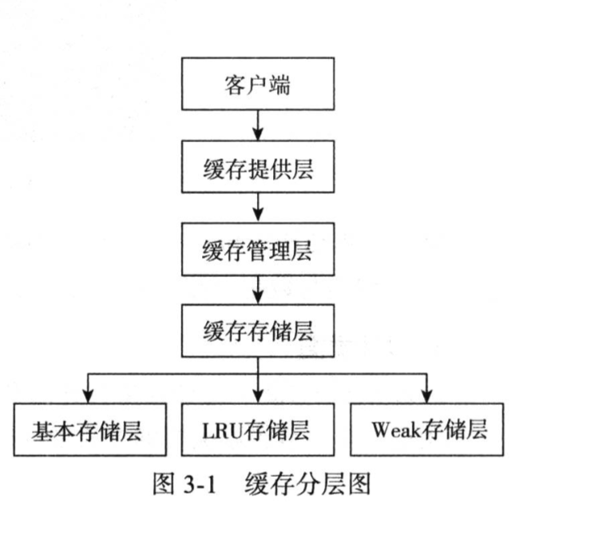

# 动手写缓存

## 核心概念

1. CacheProvider

定义了访问 配置 获取 管理 控制 多个 CacheManager

2. CacheManager

定义了访问 配置 获取 管理 控制 多个 唯一命名的Cache，这些Cache 存在于CacheManager上下文
一个 CacheManager 被一个CacheProvider所拥有

3. Cache

类似HashMap的存储结构，一个Cache 仅被一个CacheManager所拥有

4. Entry

存储在 Cache 里的存储结构

## 架构介绍

1. 客户端层 
使用者直接通过该层与数据交互

2. 缓存提供层 
主要对缓存管理层的生命周期进行维护，负责缓存管理层的创建，保存、获取以及销毁。

3. 缓存管理层 
主要对缓存客户端的生命周期进行维护，负责缓存客户端的创建，保存、获取以及销毁

3. 缓存存储层 
负责数据以什么样的形式进行存储。

4. 基本存储层 
以普通的ConcurentHashMap为存储核心，进行数据淘汰

5. LRU存储层 
以最近最少使用算法对数据进行存储于淘汰

6. Weak存储层 
以最弱引用原则对数据进行存储于淘汰

### 缓存的常见方法

 表3-2简单缓存的常用方法

接口 |  说明 |   EhCache | Guava | CsCache
--- |--- |--- |--- |--- 
clear| 清空缓存 | √ | √ |  √|
get   | 根据Key获取| √ | √ | √ |
getAll(keys)| 根据Key列表获取，如果未命中可能触发加载动作| √ | √ ||
getAllPresent(keys)| 根据Key列表获取，如果未命中不会触发加载动作|| √ ||
keySet()|获取所有key列表|  | |  |
put(K,V)| 写入一个k/v| √ | √ | √ |
putAll(entries)| 将entries写入缓存| √ | √ ||
putIfAbsent|如果缓存中没有则写入| √ | √ ||
remove| 删除一个key | √ | √ | √ |
remove(K,V)| 匹配k/v删除| √ | √ ||
removeAll(keys)| 根据key列表删除|  √ | √ ||
replace(K,V)| 替换一个key |  √ | √ ||
replace (K,V,V) | 匹配k/v替换| √ | √ ||

### 框架核心类列表

|类名  | 类型  | 说明 |
          ----       | ---| ---- 
|CsCache             | 类  | 直接使用CsCache的时候，接口类|
DataStore            |接口 |存储数据的规范定义
BasicDataStore       |类   |使用ConcurrentHashMap实现的简单数据存储
WeakValueDataStore   |类   |使用ConcurrentHashMap实现的弱引用数据存储
LRUDataStore         |类   |使用ConcurrentHashMap实现LRU算法的数据存
ValueHolder          |接口  |具体存储值的规范定义
BasicValueHolder     |类   |简单的强引用值存储类
WeakValueHolder      |类   |简单的弱引用值存储类
LRUEntry             |类   |实现了简单LRU的数据存储类
*CsCache107          |类   |用于适配JSR107标准
*CsCache107Manager   |类   |用于实现JSR107标准中的CacheManager，管理多个cache实例
*CsCaching107Provider|类   |实现了JSR107标准中的CacheProvider，用于提供SPI服务
----------------------------------------------------------------------------

